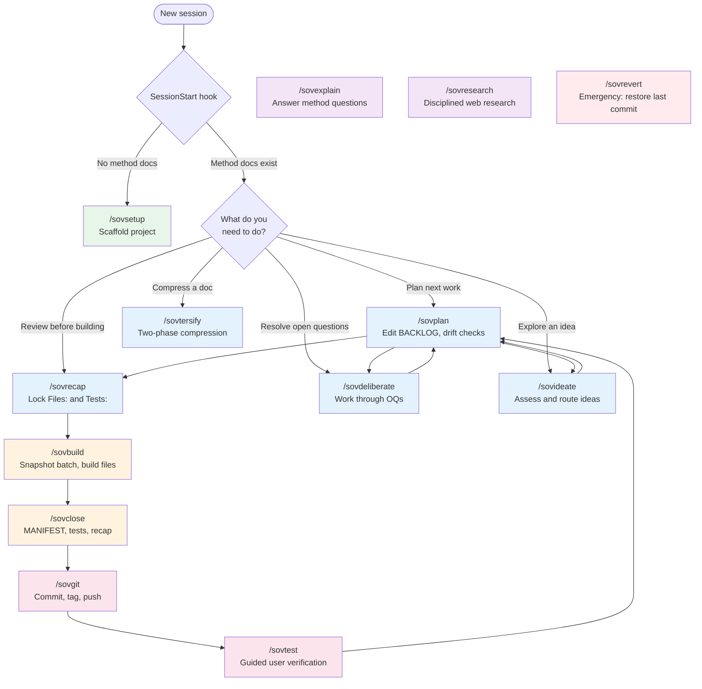

# Skill invocation flowchart and prerequisite audit

Research artifact for batch 0142. Produced v142, 2026-05-29.

## Flowchart — valid skill invocation paths

### Reading the flowchart

**Colour key:**
- Green — setup (one-time)
- Blue — planning phase skills
- Orange — build phase skills
- Pink — post-build skills
- Purple — anytime skills (no phase restriction)
- Red — emergency skill

**The rigid cycle** (most common path): `/sovplan` → `/sovrecap` → `/sovbuild` → `/sovclose` → `/sovgit` → `/sovtest` → back to `/sovplan`.

**Valid deviations:**
- `/sovdeliberate` and `/sovideate` can interrupt planning at any point, then return to `/sovplan`.
- `/sovtersify` is standalone — invoke when a doc needs compression, return to whatever you were doing.
- `/sovexplain` and `/sovresearch` are truly anytime — no phase restriction, no state changes.
- `/sovrevert` is emergency-only — restores to last commit from any state.

**Invalid paths the plugin catches:**
- Building without method docs → SessionStart routes to `/sovsetup`.
- `/sovbuild` with unconfirmed test rows → PreToolUse denies file edits, directs to planning.
- Editing source files during planning → PreToolUse denies.
- Editing method docs during build (except snapshot and BACKLOG red flags) → PreToolUse denies.
- Committing with an open build snapshot → PreToolUse denies git commit.

## Prerequisite audit — findings

### Gap 1: /sovtersify phase gate checks legacy marker (MEDIUM)

`tersify.md` line 5 checks for `Status: active` in the BACKLOG batch heading. Since V90, the build-in-progress signal is the existence of `_method/active-build.md` (the build snapshot). The legacy `Status: active` marker is never written. The phase gate is dead — `/sovtersify` would run during a build when it shouldn't.

**Fix:** Replace the `Status: active` check in `tersify.md` with a check for `_method/active-build.md`.

### Gap 2: /sovbuild doesn't verify Files: populated (MEDIUM)

`/sovbuild` parses the top batch via `parse_backlog.py` and checks for empty `{}`. But it doesn't verify that Files: entries exist. If `/sovrecap` was skipped (or failed silently), the batch has change-list bullets but no Files: sub-section. The build procedure's per-file work loop would have zero iterations — a vacuous "successful" build that does nothing, then prompts `/sovclose`.

**Fix:** Add a check in `build.md` after parsing: if `files` array is empty, halt and direct user to run `/sovrecap` first.

### Gap 3: Planning skill docs say "never during builds" but V90 permits it (LOW)

`planning.md` line 1, `deliberate.md` line 3, and `ideate.md` line 3 all say "never during building." But since V90, `/sovbuild` extracts the batch to `active-build.md` and unlocks BACKLOG. SessionStart explicitly says planning skills are safe in parallel sessions. The procedure docs are stricter than the architecture requires.

**Impact:** A user who reads the procedure would avoid planning during a build unnecessarily. The hooks don't enforce this restriction — only the procedure text does.

**Fix:** Soften the procedure language to "not in the same session as a build" rather than "never during builds." Or add a note that parallel-session planning is permitted when a build snapshot exists.

### Gap 4: /sovrecap doesn't check for active build snapshot (MEDIUM)

`before-build.md` validates the top BACKLOG batch — but if a build is already in progress (`_method/active-build.md` exists), the top batch has already been extracted. `/sovrecap` would either find the *next* batch (wrong one) or find nothing and halt with a confusing "no batch found" message.

**Fix:** Add a check at the top of `before-build.md`: if `_method/active-build.md` exists, halt and tell the user a build is in progress — finish it with `/sovclose` or revert with `/sovrevert`.

### Gap 5: /sovtest doesn't explain mid-build "no tests" result (LOW)

`testing.md` walks the user through pending User-verified test rows. It doesn't check whether a build is in progress. Mid-build, the test-confirmation gate guarantees previous rows are confirmed, and the current build hasn't written rows yet. So `/sovtest` mid-build just finds nothing — harmless but confusing.

**Fix:** Add a note in `testing.md`: if `_method/active-build.md` exists, tell the user test rows for the current build don't exist yet (they're written at `/sovclose`).

---

*Sovereign Implementer — Version 112.*
